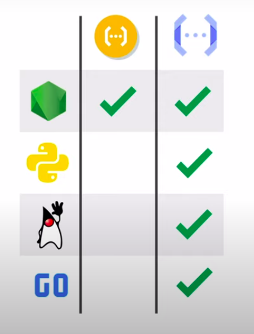

# Cloud Functions

<TagLinks />


* is a serverless framework that lets you automatically run backend code in response to events triggered by Firebase features and HTTPS requests.
* events
  * did user log in for the first time, send them a welcome email
  * Did user enter a new value, update it into DB via function
  * did user update photo, manululate, resize, add filter all on Cloud
  * Cloud messaging, send messages to friends
* Each function runs in isolation, in its own environment with its own configuration.
* Auto-scaling default, no need to worry about holiday time
* Functions are written in either javascript or Typescript
  * TypeScript supports latest JavaScript features like async/await, simplifying promise management
* All typescript files are compiled to plain javascript and saved in `lib` directory



Webpack serves an important job. It bundles all the scattered Typescript’s modules/files and bundle them into a single index.js Javascript file. This is important because the Cloud Functions will only use that single file for deployment.

How to make use to async/await syntax in typescript or ECMA acript 2017 to write better, safer coould functions

async
: javascript promise

await
: wait for promise resolve or promise fail

deployed URL
https://us-central1-named-messenger-MY_PROJECT.cloudfunctions.net/helloWorld

```
firebase login
firebase init functions

tree functions/ -L 1
functions/
|-- node_modules
|-- package.json
|-- package-lock.json
|-- src
|-- tsconfig.json
`-- tslint.json

```

[docs]: https://firebase.google.com/docs/web/setup

## Providers

> Cloud Functions is a serverless execution environment for building and connecting cloud services.

1. [Google Cloud Functions](https://cloud.google.com/functions/pricing)
   1. NodeJS
   2. Python
   3. Go
   4. Java
2. [Firebase Cloud Functions](https://firebase.google.com/pricing/)
   1. Javascript
   2. Typescript

Serverless Functions are kind of [webhooks](https://en.wikipedia.org/wiki/Webhook)

FREE Features | GCF | FCF
--------------|-----|-------
Invokations   | 2,000,000 /month | 125,000 /month

In addition to the 2 million invocations, the free tier provides 400,000 GB-seconds, 200,000 GHz-seconds of compute time, and 5GB of Internet egress traffic per month.

GCP free tier (one time) and always free services (monthly)

How to deal with secrets in cloud functions?
1. [Use environment variables](https://cloud.google.com/functions/docs/env-var)
2. Use Google Secret Key Manager services

MIME Types
```
image/jpg
image/png
text/plain
text/html
```

<iframe width="560" height="315" src="https://www.youtube.com/embed/zR6CsTLTPsk" frameborder="0" allow="accelerometer; autoplay; encrypted-media; gyroscope; picture-in-picture" allowfullscreen></iframe>

<Footer />
